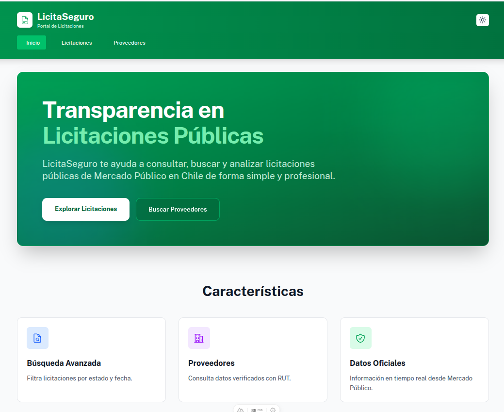
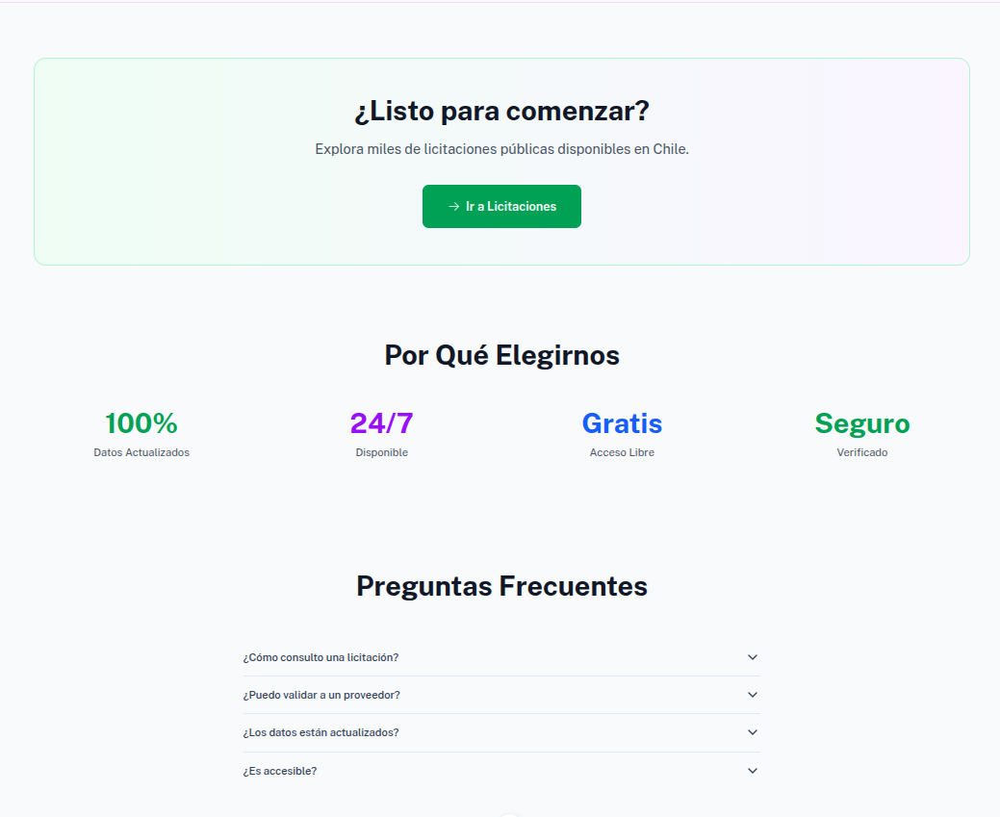
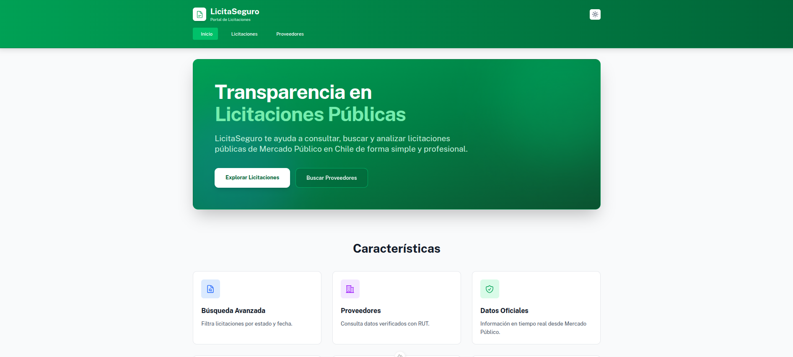
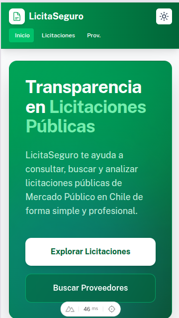
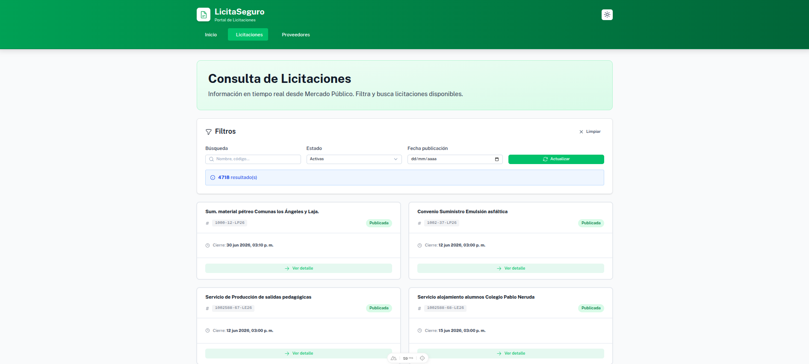
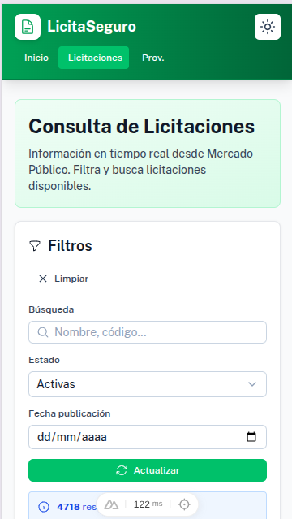
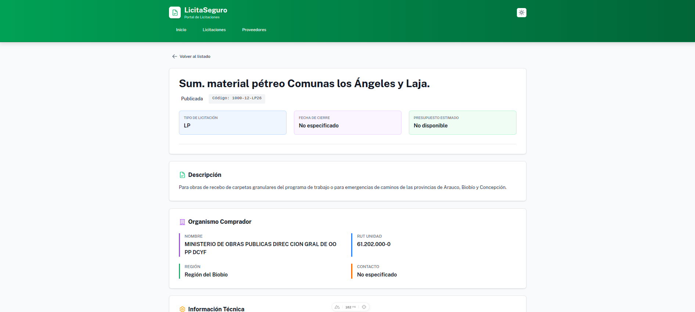
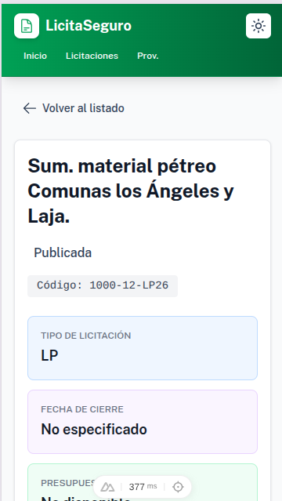
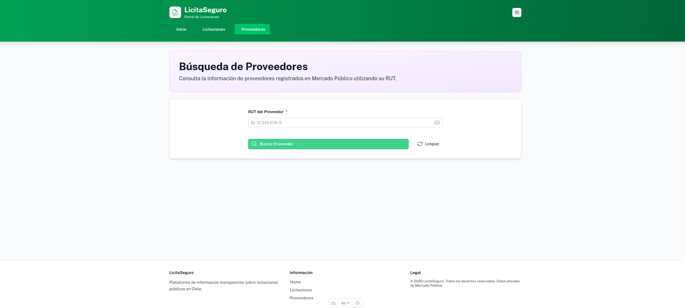
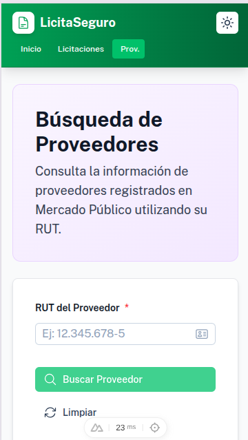

# LicitaSeguro 🏛️




Portal web público para consultar licitaciones y proveedores de **Mercado Público de Chile**, desarrollado como proyecto final del curso de Desarrollo Frontend — Instituto Profesional San Sebastián.

---

## 📋 Descripción del Proyecto

**LicitaSeguro** es una plataforma que facilita el acceso transparente a información sobre licitaciones públicas en Chile. Permite a los usuarios:

- 📄 Consultar y navegar el listado de licitaciones disponibles en Mercado Público
- 🔍 Filtrar licitaciones por fecha y estado
- 📑 Ver detalles de cada licitación
- 🏢 Buscar proveedores por RUT
- 🏠 Homepage corporativo que dirige a estos módulos

---

## 🖼️ Capturas de Pantalla


| Vista | Desktop | Móvil |
|-------|---------|-------|
| Home |  |  |
| Licitaciones |  |  |
| Detalle Licitación |  |  |
| Proveedores |  |  |

---

## ⚙️ Requisitos Previos

Antes de instalar el proyecto, asegúrate de tener instalado:

- [Node.js](https://nodejs.org/) versión **18.x o superior**
- [Yarn](https://yarnpkg.com/) versión **1.x o superior**

Para verificar tu versión actual:

```bash
node --version
yarn --version
```

Si no tienes Yarn instalado:

```bash
npm install -g yarn
```

---

## 🔑 Configuración del Ticket API

> ⚠️ **IMPORTANTE:** Para consumir la API de Mercado Público necesitas un **ticket de autenticación**. Este ticket será entregado en un documento PDF adjunto a la evaluación.

### Pasos para configurar el ticket:

**1.** En la raíz del proyecto, crea un archivo llamado `.env`:

```bash
# En la raíz del proyecto (misma carpeta que nuxt.config.ts)
touch .env
```

**2.** Abre el archivo `.env` y agrega tu ticket:

```env
NUXT_PUBLIC_API_TICKET=aquí_va_tu_ticket
```

> Reemplaza `aquí_va_tu_ticket` con el código entregado en el PDF adjunto.

**3.** El archivo `.env` **no debe subirse a repositorios públicos**. Ya está incluido en `.gitignore` por defecto.

### ¿Cómo funciona internamente?

El ticket se lee desde `nuxt.config.ts` y se expone como variable pública:

```ts
// nuxt.config.ts
export default defineNuxtConfig({
  runtimeConfig: {
    public: {
      apiTicket: process.env.NUXT_PUBLIC_API_TICKET
    }
  }
})
```

Y se consume en los componentes así:

```js
const config = useRuntimeConfig()
const ticket = config.public.apiTicket
```

---

## 🚀 Instalación y Ejecución

### 1. Descomprime el proyecto

```bash
# Descomprime el archivo entregado
unzip examen_perez_benavente_carreno.zip

# Entra a la carpeta del proyecto
cd examen_perez_benavente_carreno
```

### 2. Instala las dependencias

```bash
yarn install
```

> Esto instalará Nuxt 3, Nuxt UI, y todas las dependencias listadas en `package.json`. Puede tardar algunos minutos.

### 3. Configura el archivo `.env`

Sigue los pasos de la sección **"Configuración del Ticket API"** más arriba.

### 4. Ejecuta el servidor de desarrollo

```bash
yarn dev
```

El proyecto estará disponible en: **http://localhost:3000**

---

## 📦 Comandos Disponibles

| Comando | Descripción |
|---------|-------------|
| `yarn dev` | Inicia el servidor de desarrollo en `localhost:3000` |
| `yarn build` | Construye el proyecto para producción |
| `yarn preview` | Previsualiza la build de producción |
| `yarn generate` | Genera el sitio estático |

---

## 🗂️ Estructura del Proyecto

```
licitaseguro/
├── .env                    # Variables de entorno (NO subir a git)
├── .env.example            # Ejemplo de variables de entorno
├── nuxt.config.ts          # Configuración de Nuxt
├── package.json            # Dependencias del proyecto
├── app.vue                 # Componente raíz
├── pages/
│   ├── index.vue           # Homepage corporativo
│   ├── licitaciones.vue    # Listado y filtros de licitaciones
│   ├── details/
│   │   └── [codigo].vue    # Detalle de licitación
│   └── proveedores.vue     # Búsqueda de proveedores por RUT
├── components/
│   ├── ItemCard.vue        # Tarjeta de licitación
│   └── AppHeader.vue       # Menú
├── layouts/
│   └── default.vue         # Layout principal con navbar y footer
└── public/
    └── screenshots/        # Capturas para documentación
```

---

## 🌐 Endpoints Consumidos

### 1. Listado de Licitaciones

```
GET https://api.mercadopublico.cl/servicios/v1/publico/licitaciones.json?ticket={ticket}
```

| Parámetro | Descripción | Ejemplo |
|-----------|-------------|---------|
| `ticket` | Código de autenticación (entregado en PDF) | `ticket=ABC123` |
| `fecha` | Fecha en formato `ddmmaaaa` (opcional) | `fecha=11062026` |
| `estado` | Estado de la licitación (opcional) | `estado=publicada` |

Estados disponibles: `publicada`, `cerrada`, `desierta`, `adjudicada`, `revocada`, `suspendida`

---

### 2. Detalle de Licitación

```
GET https://api.mercadopublico.cl/servicios/v1/publico/licitaciones.json?codigo={codigo}&ticket={ticket}
```

| Parámetro | Descripción | Ejemplo |
|-----------|-------------|---------|
| `codigo` | Código externo de la licitación | `codigo=1057384-75-L126` |
| `ticket` | Código de autenticación (entregado en PDF) | `ticket=ABC123` |

---

### 3. Búsqueda de Proveedor por RUT

```
GET https://api.mercadopublico.cl/servicios/v1/Publico/Empresas/BuscarProveedor?rutempresaproveedor={rut}&ticket={ticket}
```

| Parámetro | Descripción | Ejemplo |
|-----------|-------------|---------|
| `rutempresaproveedor` | RUT proveedor| `rutempresaproveedor=12.345.678-5` |
| `ticket` | Código de autenticación (entregado en PDF) | `ticket=ABC123` |

---

## 🛡️ Manejo de Errores

El proyecto maneja los siguientes escenarios:

- **API no disponible:** Muestra mensaje "No se pudo cargar. Intenta de nuevo."
- **Sin resultados:** Muestra estado vacío con ícono y mensaje descriptivo
- **RUT inválido:** Muestra mensaje de error con formato esperado (`12.345.678-9`)
- **Campos nulos en API:** Muestra `--` en lugar de valores vacíos

---

## ♿ Accesibilidad

El proyecto implementa las siguientes prácticas de accesibilidad (WCAG 2.1):

- Etiquetas `<label>` en todos los campos de formulario
- Atributos `aria-label` y `aria-live` en elementos dinámicos
- Navegación por teclado con `tabindex` correcto
- Contraste de color mínimo 4.5:1 en textos normales
- Textos alternativos `alt` en todas las imágenes

---

## 👥 Integrantes del Equipo

| Nombre | Rol |
|--------|-----|
| Sofia Benavente Brantes | Desarrollo Frontend |
| Mixiu Pérez Iriarte | Desarrollo Frontend |
| Andrea Carreño Coppo | Desarrollo Frontend |

---

## 📚 Tecnologías Utilizadas

- [Nuxt 3](https://nuxt.com/) — Framework Vue.js
- [Nuxt UI](https://ui.nuxt.com/) — Componentes UI
- [Tailwind CSS](https://tailwindcss.com/) — Estilos utilitarios
- [Yarn](https://yarnpkg.com/) — Gestor de paquetes
- [API Mercado Público](https://api.mercadopublico.cl/) — Fuente de datos

---

## 📄 Licencia

Proyecto académico — Instituto Profesional San Sebastián © 2026